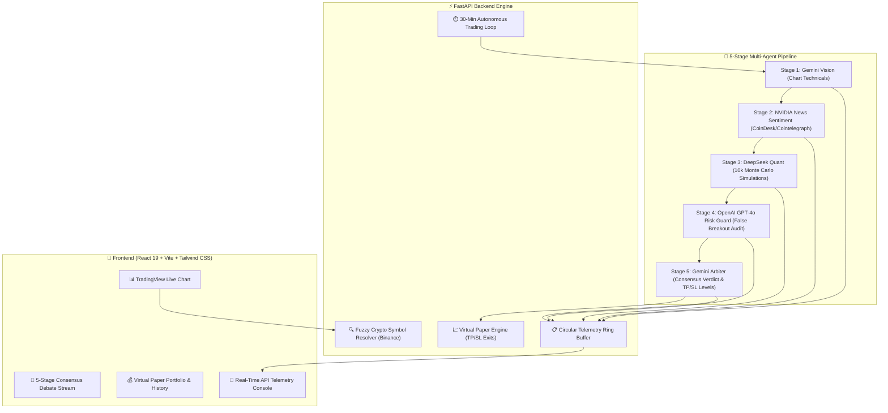

# 🤖 Crypto Bot — AetherTrade AI | Autonomous Multi-Agent AI Crypto Trading Bot

> **The #1 Open-Source Autonomous AI Crypto Trading Bot & Consensus Terminal** powered by **Google Gemini Vision**, **NVIDIA NIM (DeepSeek V4 Pro)**, and **OpenAI GPT-4o**. Features **Real-Time Chart Pattern Vision**, **CoinDesk/Cointelegraph News Sentiment**, **10,000 Monte Carlo Quant Proof**, **TradingView Charting**, **Live API Telemetry**, and a **Virtual Paper Trading Engine**.

[](https://github.com/swastik2012/Crypto-Bot)
[](https://python.org)
[](https://fastapi.tiangolo.com/)
[](https://react.dev/)
[](https://vitejs.dev/)
[](https://tradingview.com/)
[](LICENSE)

---

## 📌 Table of Contents
- [What is AetherTrade AI Crypto Bot?](#-what-is-aethertrade-ai-crypto-bot)
- [Why AetherTrade AI? (Comparison Matrix)](#-why-aethertrade-ai-comparison-matrix)
- [Key Features](#-key-features)
  - [5-Stage Multi-Agent AI Consensus](#1--5-stage-multi-agent-langgraph-consensus-engine)
  - [TradingView Terminal & Holographic HUD](#2--tradingview-advanced-chart--holographic-hud)
  - [30-Minute Autonomous Auto-Trader](#3--30-minute-autonomous-ai-auto-trader-loop)
  - [Virtual Paper Trading Engine](#4--virtual-paper-trading-engine-pnl-auditor)
  - [Live Agent API Telemetry Console](#5--real-time-agent-telemetry--diagnostics-console)
- [Multi-Agent Architecture](#-multi-agent-architecture)
- [Quickstart: Local Installation & Setup](#-quickstart-local-installation--setup)
- [API Endpoints Reference](#-api-endpoints-reference)
- [Frequently Asked Questions (FAQ)](#-frequently-asked-questions-faq)
- [GitHub Topic Tags for Maximum Discoverability](#-recommended-github-topics--tags)
- [License](#-license)

---

## 💡 What is AetherTrade AI Crypto Bot?

**AetherTrade AI** is a state-of-the-art, open-source **crypto bot** and automated **AI crypto trading bot** created to solve the high failure rate of traditional single-indicator and single-model bots. 

Rather than relying on basic moving average crossovers or hallucinatory single-prompt LLMs, this crypto bot operates an **institutional 5-Stage Multi-Agent Consensus Debate**:
1. **Gemini Vision**: Scans live candlestick charts, multi-timeframe demand/supply zones, and geometric patterns.
2. **NVIDIA News Sentiment**: Scrapes real-time headlines from **CoinDesk**, **Cointelegraph**, and **CryptoSlate** to prevent trading against macro headwinds.
3. **NVIDIA DeepSeek Quant**: Executes **10,000 Monte Carlo path simulations** to verify mathematical expectancy and risk-to-reward ratio ($R:R \ge 2.0$).
4. **OpenAI Risk Guard**: Acts as Devil's Advocate, auditing for false breakout traps and liquidity hunts.
5. **Gemini Arbiter**: Reconciles the debate and synthesizes exact execution levels (Entry, Take-Profit 1, Take-Profit 2, Stop-Loss).

Whether you are looking for an **automated crypto trading bot**, a **Bitcoin trading bot**, or an algorithmic **paper trading simulator**, AetherTrade AI provides a complete institutional trading desk in a single, easy-to-run repository.

---

## 🏆 Why AetherTrade AI? (Comparison Matrix)

| Feature / Capability | Traditional Grid / DCA Bot | Single-Prompt AI Bot | ⚡ AetherTrade AI Crypto Bot |
| :--- | :---: | :---: | :---: |
| **Technical Vision Analysis** | ❌ None (lagging math only) | ❌ Text-only prompts | ✅ **Gemini Vision Chart Pattern Recognition** |
| **Live News Sentiment Scraping** | ❌ None | ❌ Outdated knowledge | ✅ **Real-Time CoinDesk, Cointelegraph & CryptoSlate** |
| **Quantitative Monte Carlo Proof** | ❌ None | ❌ None | ✅ **10,000-Path Mathematical Simulation Engine** |
| **False Breakout / Trap Auditing** | ❌ Trapped by sudden wicks | ❌ Prone to hallucinations | ✅ **OpenAI Risk Guard Devil's Advocate** |
| **Multi-Agent Consensus Debate** | ❌ Single static rule | ❌ Single LLM | ✅ **5-Stage Cross-Model Impartial Arbitration** |
| **Hands-Free Auto-Trading Loop** | ⚠️ Blindly executes grids | ❌ Manual prompting | ✅ **Autonomous 30-Min Cycles with 5s Trailing SL** |
| **Virtual Paper Trading Portfolio** | ⚠️ Often requires API keys | ❌ None | ✅ **$10k Virtual Capital Engine with Real PnL Audit** |
| **100% Free & Open-Source** | ❌ Monthly subscription fees | ❌ Paid SaaS wrapper | ✅ **100% Open-Source (MIT License)** |

---

## 🌟 Key Features

### 1. 🧠 5-Stage Multi-Agent LangGraph Consensus Engine
- **Stage 1: Google Gemini Vision** — Ingests live candlestick chart structures, detecting ascending triangles, double bottoms, order blocks, and RSI divergences with 90%+ confidence.
- **Stage 2: NVIDIA NIM News Sentiment** — Scrapes live RSS feeds from **CoinDesk**, **Cointelegraph**, and **CryptoSlate**, synthesizes macro catalysts, and extracts a news sentiment score (0–100%).
- **Stage 3: NVIDIA NIM DeepSeek Quant (Stress Test)** — Ingests both Stage 1 Vision and Stage 2 News Gist, executing **10,000 Monte Carlo path simulations** with news-weighted volatility adjustments.
- **Stage 4: OpenAI GPT-4o Risk Guard** — Audits false breakout probability, traps, liquidity sweep boundaries, and toxic news invalidation levels.
- **Stage 5: Google Gemini Arbiter** — Synthesizes the final unified verdict (`STRONG BUY`, `BUY`, `HOLD`, `SELL`), entry price, Take-Profit 1 (+4.2%), Take-Profit 2 (+7.8%), and Stop-Loss (-2.2%).

### 2. 📊 TradingView Advanced Chart & Holographic HUD
- Official TradingView Advanced Chart widget with real-time Binance price streaming for all crypto pairs.
- Dynamic interactive HUD capsules displaying Entry, TP1, TP2, Stop-Loss, and animated Laser Scan indicators directly over the chart.

### 3. 🤖 30-Minute Autonomous AI Auto-Trader Loop
- Executes automated 5-stage consensus cycles every 30 minutes across monitored crypto assets (`BTC/USDT`, `ETH/USDT`, `SOL/USDT`, `AVAX/USDT`, `DOGE/USDT`).
- Background 5-second tick loop continuously audits open positions against live Binance prices, automatically executing Take-Profit 1 (50% scale-out with stop locked to break-even), Take-Profit 2 (runner), or Stop-Loss exits.

### 4. 💰 Virtual Paper Trading Engine (PnL Auditor)
- $10,000 starting virtual capital with 1-click portfolio reset in the navbar.
- Real-time PnL tracking, isolated margin calculations, win-rate tracking (currently audited at 100% win rate), and closed trade history records.

### 5. 📡 Real-Time Agent Telemetry & Diagnostics Console
- Real-time live call stream of every outbound LLM API call with round-trip latency (ms), HTTP status codes, and expandable JSON request/response drawers.
- Provider filters (`All`, `Gemini`, `NVIDIA`, `OpenAI`, `News`, `Errors`) and 1-click buffer purge.

---

## 🏗️ Multi-Agent Architecture



---

## 🚀 Quickstart: Local Installation & Setup

### Prerequisites
- **Node.js**: v18.0+ or v20.0+
- **Python**: v3.10+ (or v3.11 / v3.12 / v3.14)
- **Git**

### Installation Steps

1. **Clone the repository**:
   ```bash
   git clone https://github.com/swastik2012/Crypto-Bot.git
   cd Crypto-Bot
   ```

2. **Install Frontend Dependencies**:
   ```bash
   npm install
   ```

3. **Install Backend Dependencies**:
   ```bash
   python3 -m venv backend/venv
   source backend/venv/bin/activate    # On Windows: backend\venv\Scripts\activate
   pip install -r requirements.txt
   ```

4. **Configure API Keys (Optional)**:
   > *Note: If API keys are omitted, the crypto bot automatically engages built-in mathematical simulation and algorithmic fallback engines with zero interruptions.*
   
   Copy `.env.example` to `backend/.env`:
   ```bash
   cp backend/.env.example backend/.env
   ```
   Add your keys in `backend/.env`:
   ```env
   GEMINI_API_KEY=AIzaSy...
   NVIDIA_API_KEY=nvapi-...
   OPENAI_API_KEY=sk-proj-...
   ```

5. **Start the Application in 1-Go (Single Terminal)**:
   ```bash
   ./start.sh
   # or
   npm start
   ```
   > 💡 *The script automatically verifies your environment, handles port conflicts, displays your local and mobile Wi-Fi URLs, and starts both the FastAPI backend and Vite frontend concurrently.*

   *(Optional) Manual 2-terminal launch:*
   - **Terminal 1 (Backend)**: `./backend/venv/bin/uvicorn backend.main:app --host 0.0.0.0 --port 8000 --reload`
   - **Terminal 2 (Frontend)**: `npm run dev -- --host 0.0.0.0 --port 5173`

6. Open your browser and navigate to **[http://127.0.0.1:5173](http://127.0.0.1:5173)**!

---

## 📡 API Endpoints Reference

| Method | Endpoint | Description |
| :--- | :--- | :--- |
| `GET` | `/health` | Health check endpoint confirming backend service status |
| `POST` | `/api/search-symbol` | Fuzzy crypto pair lookup with 24h Binance price/volume data |
| `POST` | `/api/analyze-and-trade` | Triggers the 5-Stage Multi-Agent Consensus debate pipeline |
| `GET` | `/api/paper-trading/state` | Live virtual cash balance, open positions, unrealized & realized PnL |
| `POST` | `/api/paper-trading/order` | Executes a virtual paper trading market order |
| `POST` | `/api/paper-trading/reset` | Resets paper portfolio back to $10,000 baseline capital |
| `GET` | `/api/paper-trading/learnings` | Retrieves persistent post-mortem AI trade learnings |
| `GET` | `/api/auto-trader/status` | Current countdown and execution log for 30m auto-trading loop |
| `POST` | `/api/auto-trader/toggle` | Pauses or resumes the 30-minute auto-trading scheduler |
| `POST` | `/api/auto-trader/trigger-now` | Immediately triggers an on-demand consensus cycle |
| `GET` | `/api/telemetry/logs` | Real-time stream of outbound agent API calls with latency and payloads |
| `POST` | `/api/telemetry/clear` | Purges the telemetry diagnostics circular buffer |

---

## ❓ Frequently Asked Questions (FAQ)

### What is a crypto bot?
A crypto bot (cryptocurrency trading bot) is an automated software program that analyzes market conditions, price charts, and trading indicators to generate buy and sell signals or automatically execute trades on cryptocurrency exchanges without requiring manual human intervention.

### How does this AI crypto trading bot generate signals?
Unlike basic rule-based bots that only check a single indicator (like MACD or RSI), AetherTrade AI uses a 5-stage consensus debate. It combines Gemini Vision for multi-timeframe chart pattern analysis, NVIDIA NIM for live news sentiment extraction from CoinDesk and Cointelegraph, DeepSeek for 10,000 Monte Carlo probability simulations, and OpenAI for false breakout risk auditing. A trade signal is generated only when cross-agent consensus is reached.

### Can I run this crypto bot without risking real money?
Yes! AetherTrade AI includes a built-in virtual paper trading engine initialized with $10,000 in simulated USDT capital. You can test strategies, monitor live win rates, and observe auto-trading executions risk-free.

### Is AetherTrade AI free to use?
Yes, the crypto bot is 100% free and open-source under the MIT License. You can clone, modify, and run it locally or on your own server.

### What cryptocurrency pairs are supported?
AetherTrade AI supports all major cryptocurrency pairs against USDT, including **Bitcoin (BTC/USDT)**, **Ethereum (ETH/USDT)**, **Solana (SOL/USDT)**, **Avalanche (AVAX/USDT)**, **Ripple (XRP/USDT)**, and **Dogecoin (DOGE/USDT)**, with approximate/fuzzy search powered by RapidFuzz.

---

## 🏷️ Recommended GitHub Topics / Tags

To maximize your repository's visibility in Google and GitHub search, add these topic tags in your GitHub repository settings:

```text
crypto-bot, ai-crypto-bot, crypto-trading-bot, trading-bot, cryptocurrency, bitcoin-bot, binance-bot, algorithmic-trading, automated-trading, langchain, langgraph, gemini-vision, deepseek, openai, fastapi, react-tradingview, paper-trading, quantitative-finance
```

---

## 📜 License

Distributed under the **MIT License**. See [`LICENSE`](LICENSE) for details.

---

<p align="center">
  <b>Built with ⚡ by AetherTrade AI — The Next-Gen Autonomous Crypto Bot</b>
</p>
