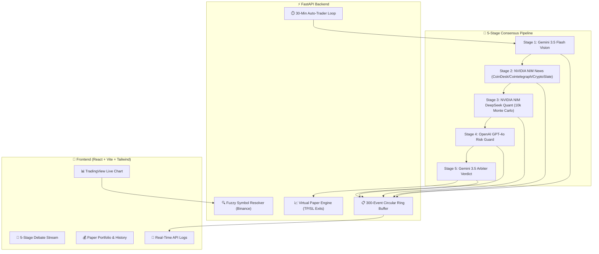

# ⚡ AetherTrade AI v2.5

> **Autonomous 5-Stage Multi-Agent Consensus Crypto Trading Terminal** powered by **Google Gemini 3.5 Flash**, **NVIDIA NIM (DeepSeek V4 Pro)**, and **OpenAI GPT-4o**, featuring **CoinDesk/Cointelegraph/CryptoSlate Live News Synthesis**, **TradingView Charting**, **Real-Time API Telemetry**, and a **Virtual Paper Trading Engine**.

[](https://reactjs.org/)
[](https://fastapi.tiangolo.com/)
[](https://tailwindcss.com/)
[](https://vitejs.dev/)
[](LICENSE)

---

## 🌟 Key Features

### 1. 🧠 5-Stage Multi-Agent LangGraph Consensus Pipeline
- **Stage 1: Google Gemini 3.5 Flash Vision** — Ingests live candlestick chart structures, detecting ascending triangles, double bottoms, order blocks, and RSI divergences with 90%+ confidence.
- **Stage 2: NVIDIA NIM News Sentiment** — Scrapes live RSS feeds from **CoinDesk**, **Cointelegraph**, and **CryptoSlate**, synthesizes macro catalysts, and extracts a news sentiment score (0–100%).
- **Stage 3: NVIDIA NIM DeepSeek V4 Pro (Quantitative Stress Test)** — Ingests both Stage 1 Vision and Stage 2 News Gist, executing **10,000 Monte Carlo path simulations** with news-weighted volatility adjustments.
- **Stage 4: OpenAI GPT-4o Risk Guard** — Audits false breakout probability, traps, liquidity sweep boundaries, and toxic news invalidation levels.
- **Stage 5: Google Gemini 3.5 Arbiter** — Synthesizes the final unified verdict (`STRONG BUY`, `BUY`, `HOLD`, `SELL`), entry price, Take-Profit 1 (+4.2%), Take-Profit 2 (+7.8%), and Stop-Loss (-2.2%).

### 2. 📊 TradingView Advanced Chart Integration & Holographic AI HUD
- Embedded official TradingView Advanced Chart widget with real-time Binance price streaming.
- Dynamic interactive HUD capsules showing live Entry, TP1, TP2, Stop-Loss, and animated Laser Scan indicators directly over the chart.

### 3. 🤖 Autonomous 30-Minute AI Auto-Trader Loop
- Runs automated 5-stage consensus cycles every 30 minutes across monitored crypto assets (`BTC/USDT`, `ETH/USDT`, `SOL/USDT`).
- Background 5-second tick loop continuously audits open positions against live Binance prices, automatically executing Take-Profit 1, Take-Profit 2, or Stop-Loss exits.

### 4. 💵 Virtual Paper Trading Engine
- $10,000 starting virtual capital with 1-click portfolio reset in the navbar.
- Real-time PnL tracking, isolated margin calculations, and closed trade history records.

### 5. 📡 Dedicated Real-Time Agent Telemetry & Diagnostics Console
- Real-time stream of every outbound LLM API call with round-trip latency (ms), HTTP status codes, and expandable JSON request/response drawers.
- Provider filters (`All`, `Gemini`, `NVIDIA`, `OpenAI`, `News`, `Errors`) and 1-click buffer purge.

---

## 🏗️ Architecture



---

## 🚀 Getting Started

### Prerequisites
- **Node.js**: v18.0+ or v20.0+
- **Python**: v3.10+ (or v3.11/v3.12/v3.14)
- **API Keys** *(Optional — fallback algorithms engage automatically if keys are omitted)*:
  - Google Gemini API Key ([Get Key](https://aistudio.google.com/))
  - NVIDIA NIM API Key ([Get Key](https://build.nvidia.com/))
  - OpenAI API Key ([Get Key](https://platform.openai.com/))

---

### Local Development Setup

1. **Clone the repository**:
   ```bash
   git clone https://github.com/your-username/aethertrade-ai.git
   cd aethertrade-ai
   ```

2. **Setup Frontend**:
   ```bash
   npm install
   ```

3. **Setup Backend**:
   ```bash
   python3 -m venv backend/venv
   source backend/venv/bin/activate    # On Windows: backend\venv\Scripts\activate
   pip install -r requirements.txt
   ```

4. **Configure Environment Variables**:
   Copy `.env.example` to `backend/.env`:
   ```bash
   cp backend/.env.example backend/.env
   ```
   Add your API keys to `backend/.env`:
   ```ini
   GEMINI_API_KEY=AIzaSy...
   NVIDIA_API_KEY=nvapi-...
   OPENAI_API_KEY=sk-proj-...
   ```

5. **Start Both Servers**:
   
   **Terminal 1 (FastAPI Backend)**:
   ```bash
   ./backend/venv/bin/uvicorn backend.main:app --host 127.0.0.1 --port 8000 --reload
   ```

   **Terminal 2 (React Frontend)**:
   ```bash
   npm run dev
   ```

6. Open **[http://127.0.0.1:5173](http://127.0.0.1:5173)** in your browser!

---

## 🌐 Deploy to Vercel (Production)

The repository is pre-configured with [`vercel.json`](vercel.json), [`api/index.py`](api/index.py), and [`.vercelignore`](.vercelignore) for zero-config Vercel Serverless deployment:

1. Push your code to GitHub:
   ```bash
   git add .
   git commit -m "Deploy to Vercel"
   git push origin main
   ```
2. Import your repo on [Vercel Dashboard](https://vercel.com/dashboard).
3. Set **Framework Preset** to `Vite`.
4. Add your Environment Variables (`GEMINI_API_KEY`, `NVIDIA_API_KEY`, `OPENAI_API_KEY`).
5. Click **Deploy**!

---

## 📡 API Endpoints

| Method | Endpoint | Description |
| :--- | :--- | :--- |
| `POST` | `/api/search-symbol` | Fuzzy crypto pair lookup with 24h Binance price/volume data |
| `POST` | `/api/analyze-and-trade` | Triggers the 5-Stage Multi-Agent Consensus pipeline |
| `GET` | `/api/paper-trading/state` | Retrieves virtual cash balance, open positions & PnL |
| `POST` | `/api/paper-trading/order` | Executes a virtual paper trading market order |
| `POST` | `/api/paper-trading/reset` | Resets paper portfolio to $10,000 and clears positions |
| `GET` | `/api/auto-trader/status` | Current countdown and execution log for 30m loop |
| `POST` | `/api/auto-trader/toggle` | Pauses / Resumes the 30-minute auto-trading scheduler |
| `POST` | `/api/auto-trader/reset-timer` | Resets the 30-minute countdown back to 30:00 |
| `GET` | `/api/telemetry/logs` | Streams recent agent API calls with latency and payloads |
| `POST` | `/api/telemetry/clear` | Purges the 300-event telemetry ring buffer |

---

## 📜 License

Distributed under the **MIT License**. See [`LICENSE`](LICENSE) for more information.
